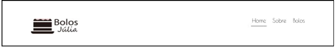
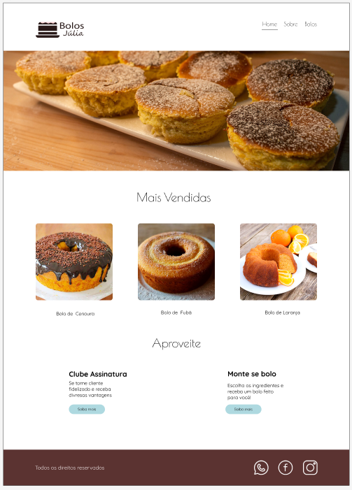
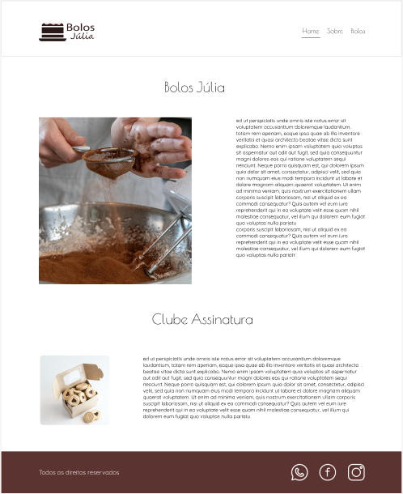
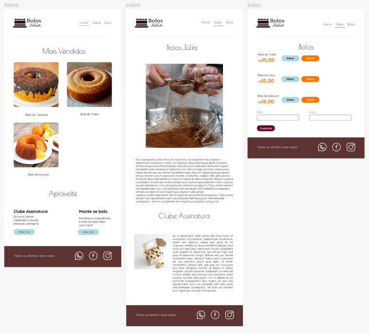
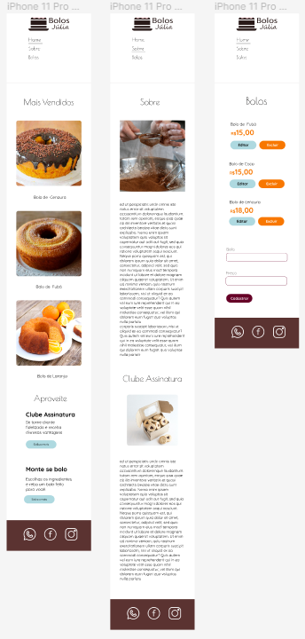
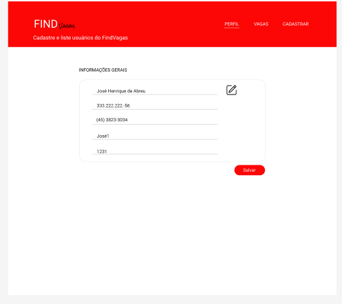
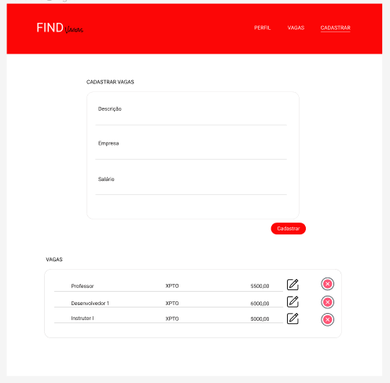
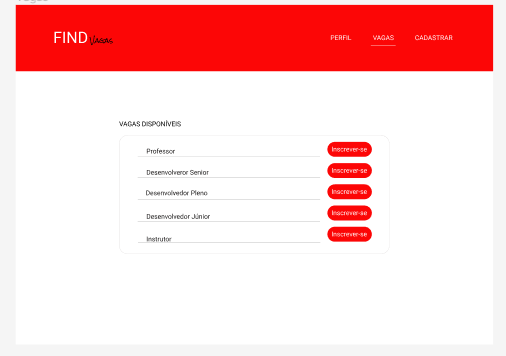

# Exercícios: Criação de Projeto Angular e Componentização

**1 -** Crie um projeto Angular com o nome 'bolosjulia'. Excluindo quaisquer arquivos que não serão
utilizados, e estruturando as pastas de acordo com o projeto.

**2 -** No projeto 'bolosjulia' crie os componentes header e footer, conforme estilizaçao do
arquivo figma:
[https://www.figma.com/file/pZXlah3MvitCpY6G2RKMhB/Exercícios-FrontEnd?node-id=0%3A1](https://www.figma.com/file/pZXlah3MvitCpY6G2RKMhB/Exerc%C3%ADcios-FrontEnd?node-id=0%3A1)

**HEADER**

**FOOTER**

**3 -** No projeto 'bolosjulia' crie a página home conforme estilizaçao do arquivo figma:
[https://www.figma.com/file/pZXlah3MvitCpY6G2RKMhB/Exercícios-FrontEnd?node-id=0%3A1](https://www.figma.com/file/pZXlah3MvitCpY6G2RKMhB/Exerc%C3%ADcios-FrontEnd?node-id=0%3A1)

**4 -** No projeto 'bolosjulia' crie a página sobre conforme estilizaçao do arquivo figma:
[https://www.figma.com/file/pZXlah3MvitCpY6G2RKMhB/Exercícios-FrontEnd?node-id=0%3A1](https://www.figma.com/file/pZXlah3MvitCpY6G2RKMhB/Exerc%C3%ADcios-FrontEnd?node-id=0%3A1)

**5 -** No projeto 'bolosjulia' crie a página bolos conforme estilizaçao do arquivo figma:
[https://www.figma.com/file/pZXlah3MvitCpY6G2RKMhB/Exercícios-FrontEnd?node-id=0%3A1](https://www.figma.com/file/pZXlah3MvitCpY6G2RKMhB/Exerc%C3%ADcios-FrontEnd?node-id=0%3A1)

**6 -** No projeto 'bolosjulia' crie a responsividade das paginas criadas para tablet conforme
estilizaçao do arquivo figma:
[https://www.figma.com/file/pZXlah3MvitCpY6G2RKMhB/Exercícios-FrontEnd?node-id=0%3A1](https://www.figma.com/file/pZXlah3MvitCpY6G2RKMhB/Exerc%C3%ADcios-FrontEnd?node-id=0%3A1)

**7 -** No projeto 'bolosjulia' crie a responsividade das paginas criadas para smartphone
conforme estilizaçao do arquivo figma:
[https://www.figma.com/file/pZXlah3MvitCpY6G2RKMhB/Exercícios-FrontEnd?node-id=0%3A1](https://www.figma.com/file/pZXlah3MvitCpY6G2RKMhB/Exerc%C3%ADcios-FrontEnd?node-id=0%3A1)

**8 -** Crie um projeto Angular com o nome 'vagas'. Excluindo quaisquer arquivos que não serão
utilizados, e estruturando as pastas de acordo com o projeto.

**9 -** No projeto 'vagas' crie o componente header, conforme estilizaçao do arquivo figma:
[https://www.figma.com/file/pZXlah3MvitCpY6G2RKMhB/Exercícios-FrontEnd?node-id=0%3A1](https://www.figma.com/file/pZXlah3MvitCpY6G2RKMhB/Exerc%C3%ADcios-FrontEnd?node-id=0%3A1)

**10 -** No projeto 'vagas' crie a página perfil conforme estilizaçao do arquivo figma
(utilizando também os conceitos e validações de formulários se julgar necessário):
[https://www.figma.com/file/pZXlah3MvitCpY6G2RKMhB/Exercícios-FrontEnd?node-id=0%3A1](https://www.figma.com/file/pZXlah3MvitCpY6G2RKMhB/Exerc%C3%ADcios-FrontEnd?node-id=0%3A1)

**11 -** No projeto 'vagas' crie a página vagas conforme estilização do arquivo figma
(utilizando também os conceitos e validações de formulários se julgar necessário):
[https://www.figma.com/file/pZXlah3MvitCpY6G2RKMhB/Exercícios-FrontEnd?node-id=0%3A1](https://www.figma.com/file/pZXlah3MvitCpY6G2RKMhB/Exerc%C3%ADcios-FrontEnd?node-id=0%3A1)

**12 -** No projeto 'vagas' crie a página cadastrar conforme estilização do arquivo figma
(utilizando também os conceitos e validações de formulários se julgar necessário):
[https://www.figma.com/file/pZXlah3MvitCpY6G2RKMhB/Exercícios-FrontEnd?node-id=0%3A1](https://www.figma.com/file/pZXlah3MvitCpY6G2RKMhB/Exerc%C3%ADcios-FrontEnd?node-id=0%3A1)

